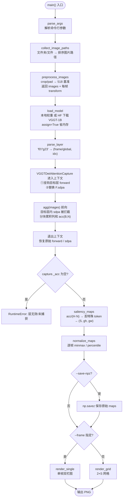
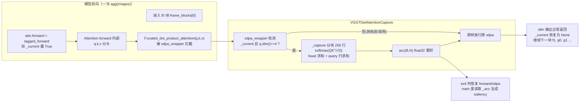

# `visualize_attention_vggtdet.py` 代码注释与原理讲解

> 配套独立流程图文件：`docs/visualize_attention_vggtdet_flow.mmd`
> 可在 VS Code 中安装 *Mermaid Preview / Markdown Preview Mermaid Support* 插件直接预览。

本脚本复现 **VGGT-Det**（`yangcaoai/VGGT-Det-CVPR2026`）官方的注意力可视化方式：
不是 `visualize_attention.py` 里的"query 框"变体，而是**逐 patch 的显著性(saliency)图**，
与任何检测框无关、逐帧独立。

---

## 1. 核心思想（一句话）

对选中的某一层 Transformer 自注意力，取出完整 softmax 注意力矩阵

$$A = \operatorname{softmax}\!\big(QK^{\mathsf T}/\sqrt{D}\big)$$

然后对所有 head、所有 query 行求平均，得到**每个 key token 平均被关注多少**：

$$s[n]=\frac{1}{H\cdot N}\sum_{h}\sum_{r} A^{(h)}[r,n]$$

最后丢掉相机/注册 token、重排成 patch 网格 $(gh,gw)$ 即可得到一张"哪儿最被注意"的热力图。

> VGGT-Det 默认取**第一个 frame-wise 块**（`vis_layer_idx=0, vis_attn_type="frame"`）。
> 官方代码还会额外用深度图 mask 掉低深度区域并做逐图 min-max 归一化；这里省略了深度 mask（需要 depth head）。

---

## 2. 文件结构速览

| 区间 | 函数/类 | 作用 |
|---|---|---|
| 头部 | — | 设 `KMP_DUPLICATE_LIB_OK`（规避 Windows OMP 双运行时崩溃）、`matplotlib` 用 `Agg` 无界面后端、把仓库根加入 `sys.path` |
| 图像加载 | `collect_image_paths` | 把"文件夹/文件列表"展开成排序后的图片路径 |
| | `preprocess_images` | 按 `load_fn` 同款逻辑预处理，并**额外返回坐标变换** `transform` |
| 注意力捕获 | `VGGTDetAttentionCapture` | 核心：挂钩某层注意力 + 替换 `F.scaled_dot_product_attention` 累积列和 |
| | `saliency_maps` | 把累积的列和换算成逐帧 $(gh,gw)$ 显著性图 |
| 归一化/渲染 | `normalize_maps` | 逐帧 min-max 或 percentile 归一化 |
| | `_overlay_extent` / `render_single` / `render_grid` | 把热力图反变换回原图坐标并叠加输出 |
| 模型加载 | `load_model` | 本地权重或 HF 下载 `facebook/VGGT-1B`，`assign=True` 省内存 |
| 主流程 | `parse_layer` / `parse_args` / `main` | 参数解析与整体调度 |

---

## 3. 分模块中文注释讲解

### 3.1 图像预处理 `preprocess_images`（镜像 `load_fn`）

- 逐张读图（RGBA 先白底合成），转 RGB。
- `mode="crop"`：统一缩放使宽=518（高取 14 的倍数），若高>518 则**居中裁剪**到 518×518；
- `mode="pad"`：长边对齐 518、短边取 14 倍数，居中贴到 518×518 白底画布上。
- 关键点：**额外记录 `transform`**（`scale_x/scale_y/off_x/off_y`），
  记录"原图 → 处理后图"的仿射关系，供后面把 patch 热力图映射回原图像素。
- 最后把所有帧 padding 到公共尺寸 `(proc_h, proc_w)`，并同步修正各帧 `offset`。

> 说明：518 / patch14 = 37 → patch 网格常为 37×37；但代码不写死，按实际 `gw=W//14, gh=H//14` 计算。

### 3.2 注意力捕获类 `VGGTDetAttentionCapture`

这是整个脚本最巧妙的部分，用**两个钩子**在真实前向中"偷看"注意力，且不用一次性物化 $N\times N$ 大矩阵：

1. `_install_hook` —— 只给**选中的那一层** `blocks[idx].attn` 换一个 `tagged_forward`，
   在调用原始 `forward` 期间把 `_current` 置 `True`（用上下文栈保存/恢复嵌套状态）。
2. `_patch_sdpa` —— 全局替换 `F.scaled_dot_product_attention` 为 `sdpa_wrapper`：
   仅当 `_current is not None` 且 `q.dim()==4`（即走到了目标层）时才触发 `_capture`，
   否则原样透传，不影响其它层和其它位置调用的 SDPA。

`_capture` 的数值做法（**分块列和，省内存**）：

- 取 `q,k` 为 float32，按 `ROW_CHUNK=256` 个 query 行分块：
  `logits = q_sel·kᵀ·(D^-0.5)`，`softmax` 后沿 head 求和、再沿该块的 query 行求和，
  累积进 `acc(B,N)`。最终 `acc` = 所有 head × 所有 query 行在每一列（key token）上的和。
- 因为只算 `softmax(QKᵀ/√D)` 的**列和**，矩阵本身从不成块驻留，float32 累积，数值稳定。

同时它校验了当前 tensor 布局，对应 `aggregator.py` 的真实执行方式：

| 类型 | 进入 attn 的形状 | 期望 |
|---|---|---|
| frame 块 | `(B*S, P, C)`，场景 batch=1 时即 `(S, P, C)` | `B == S`，`N == P` |
| global 块 | `(B, S*P, C)`，场景 batch=1 | `B == 1`，`N == S*P` |

> 由此可解释脚本强制"场景 batch 必须为 1"的断言来源。

### 3.3 `saliency_maps` —— 还原显著性图

```text
acc / (H * N)      # 相当于 attn.mean(heads).mean(query_rows)
frame 类: (S, P)   → 取 [patch_start_idx:] → (S, gh, gw)
global 类: (1, S*P) → view(S, P) → 取 [patch_start_idx:] → (S, gh, gw)
```

其中 `patch_start_idx = 1 + num_register_tokens`：VGGT-1B 为 `1 + 4 = 5`，
即每帧 token 序列 = `[camera, register×4, patch…]`，可视化只需保留 patch 部分。

### 3.4 归一化与渲染

- `normalize_maps`：**逐帧**做 min-max（VGGT-Det 默认）或 percentile 裁剪，互不影响对比度。
- `_overlay_extent(t)`：把"处理后图像素 → 原图像素"求出来（对 `scale/offset` 求逆），
  这样 `imshow(heatmap, extent=…)` 时热力图能**精确叠在原始图上**。
- `render_single`：单帧左原图、右叠加热力图的双栏图；
- `render_grid`：多帧时 `2×S` 网格（上排原图、下排叠加），每列一帧。

### 3.5 `load_model`（Windows 显存友好）

优先走 Hugging Face `facebook/VGGT-1B` 的 `model.safetensors`：

1. 先用 `st.load_file` **mmap 加载权重**（不会一次性全读进内存）；
2. 再 `VGGT()` 建模型并 `load_state_dict(..., assign=True)`，让参数**直接复用** mmap 缓冲；
3. 之后才 `.to(device, dtype)`。

顺序上"先权重、后建模型 + assign"避免了在 16GB 内存机器上同时驻留两份 ~4.8GB 的权重副本导致进程崩溃。脚本同样支持 `--weights` 加载本地 state dict。

---

## 4. 主流程整体流程图



## 5. 捕获机制（钩子）流程图



> 实际块执行顺序为 **f0, g0, f1, g1, …, f23, g23**（`aa_order=["frame","global"]`、`aa_block_size=1`、`depth=24`，交替执行 24 轮）。脚本默认 `--layer f0` 即第一个被执行到的 frame-wise 块。

---

## 6. 参数速查

| 参数 | 默认 | 说明 |
|---|---|---|
| `--images` | 必填 | 图片文件/文件夹，多帧按名称排序 |
| `--layer` | `f0` | 要可视化的层，`f`=frame 块，`g`=global 块，后接索引 0..23 |
| `--frame` | `None` | 只渲染某帧；缺省渲染全部帧网格 |
| `--mode` | `crop` | 预处理模式：`crop`/`pad`，与 `load_and_preprocess_images` 一致 |
| `--weights` | `None` | 本地 checkpoint；缺省自动下载 `facebook/VGGT-1B` |
| `--device` / `--dtype` | 自动 | 计算设备与精度 |
| `--norm` | `minmax` | 逐帧归一化：`minmax`（VGGT-Det）/ `percentile` |
| `--cmap` / `--alpha` | `jet` / `0.55` | 热力图配色与透明度 |
| `--out` | `attention_vggtdet.png` | 输出图 |
| `--save-npz` | `None` | 额外保存原始 map（含 `layer/gw/gh/patch_size` 元数据） |

---

## 7. 常见问题与注意点

- **必须场景 batch = 1**：脚本在多处断言 `B==S`（frame）或 `B==1`（global），否则直接抛错。这是由 `aggregator.py` 的 tensor 布局决定的，不是 bug。
- **修改模型代码风险**：通过 monkey-patch `attn.forward` 与全局替换 `F.scaled_dot_product_attention` 实现零侵入捕获；若 VGGT 未来把 `fused_attn` 关掉走手动分支，`_capture` 将不再被触发（会报 `_acc is None`）。当前官方默认 `fused_attn=True` 使用 SDPA，脚本成立。
- **数值一致性**：脚本用 `D**-0.5` 缩放，与 SDPA 默认 `scale = head_dim^-0.5` 一致；`qk_norm=True` 时 `q,k` 已归一化，等价于官方路径。
- **Windows 内存**：若在低内存机器崩溃，优先确认走了 HF `assign=True` 路径（非 `--weights`），并开启 `KMP_DUPLICATE_LIB_OK`。
